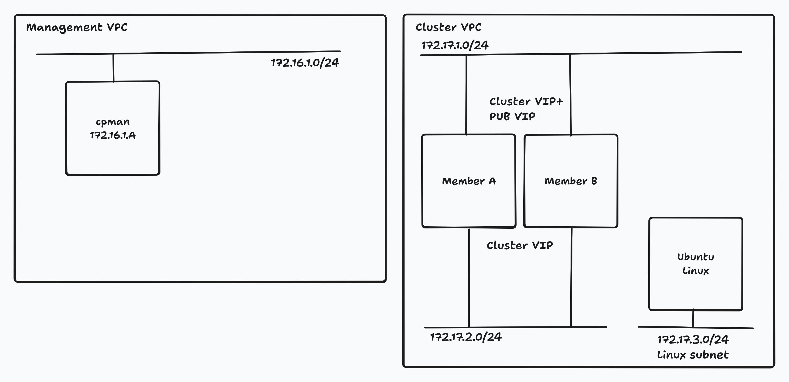

# CloudGuard Network Security - AWS lab

Repository to demonstrate CloudGuard NS deployment automation into AWS using Terraform.

## Building blocks
- [AWS account](https://aws.amazon.com/) with neccessary permissions to deploy resources.
- [Terraform](https://www.terraform.io/) - Infrastructure as Code tool to deploy resources in AWS and manage CP policy.
- [Check Point Terraform Modules](https://github.com/CheckPointSW/terraform-aws-cloudguard-network-security) for various CloudGuatd NS deployments in AWS

### Diagram



## Instructions

### Management Server

Open project in [Codespace](https://github.com/codespaces/new?repo=mkol5222/cp-aws-lab) or localy in DevContainer and continue.
This environment already has all required tools like `terraform`, AWS CLI installed.

Consider forking this repo [`mkol5222/cp-aws-lab`](https://github.com/mkol5222/cp-aws-lab) before continuing and open Codespace of your forked repository.

Bring AWS credentials into environment variables:
```shell
# consider saving to ~/.envrc
export AWS_ACCESS_KEY_ID="your_access_key_id"
export AWS_SECRET_ACCESS_KEY="your_secret_access_key"
# ...
# we have prepared lab in eu-north-1 - hardcoded
export AWS_DEFAULT_REGION="eu-north-1"
export AWS_REGION="eu-north-1" 
```

Maagement server deployment is defined in [`managememt/management.tf`](./management/management.tf) file based on usage instructions from module's [README file](https://github.com/CheckPointSW/terraform-aws-cloudguard-network-security/tree/master/modules/management#usage).

Deploy Check Point Management Server and wait until it is ready:
```shell
make cpman
```

You can monitor deployment progress with serial line console of new instance:
```shell
make cpman-serial
```

Exit with key sequence `Enter` and then `~.`.

Later SSH will be possible. One can wait for SSH to be available using:
```shell
while true; do make cpman-ssh; sleep 5; done
```

Best strategy is to wait for Mangement API to be ready and then retrieve IP and password for the Management Server to connect using SmartConsole R81.20:
```shell
# wait for Management API to be ready
make cpman-wait
# retrieve IP and password
make cpman-pass
```

## Gateway Cluster (single AZ)

Check Point CloudGuard NS cluster is defined in [`cluster/02-cluster/cluster.tf`](./cluster/02-cluster/cluster.tf) file based on usage instructions from relevant Terraform module [README file](https://github.com/CheckPointSW/terraform-aws-cloudguard-network-security/tree/master/modules/cluster#usage)

Deploy Check Point Gateway Cluster and wait until it is ready:
```shell
# start deployment
make cluster
# check if Member A is read
make cluster-serial-a
# check if Member B is ready
make cluster-serial-b
# reminder: serial console can be exited with key sequence `Enter` and then `~.`

# IMPORTANT: continue only when both members are ready and you are able to SSH into them
make cluster-ssh-a
make cluster-ssh-b
```

Once instances are ready, we need to add them to Security Management Server.
This can be automated by `mgmt_cli` command for management CLI doing `add simple-cluster` API operation.
```shell
# fetch topology and create command
make cluster-topo
# login to Management Server to run mgmt_cli command
#   ONCE BOTH MEMBERS ARE READY AND REACHAEBLE OVER NETWORK (= you can SSH into them)
make cpman-ssh

```

Next review policy in SmartConsole R81.20 and publish it to the cluster.

This is how you can text connectivity through cluster to the Internet from provided text Linux EC2 instance:
```shell
make cluster-linux-serial
```


## Reference

| Command             | Description                                                      |
|---------------------|------------------------------------------------------------------|
| `make cpman`        | Deploys the Check Point Management Server                        |
| `make cpman-serial` | Monitors deployment progress via the serial line console         |
| `make cpman-ssh`    | Attempts to SSH into the Check Point Management Server instance  |
| `make cpman-wait`   | Waits for the Check Point Management Server to be ready          |
| `make cpman-pass`    | Retrieves IP and the password for the Check Point Management Server     |
| `make cluster` | Deploy cluster and Linux test VM |
| `make cluster-topo` | Get `add simple-cluster` command to add cluster to Management zero effort |

... and more in [`Makefile`](./Makefile)

## Cleanup

To remove Security Management server:
```shell
make cpman-down
```
